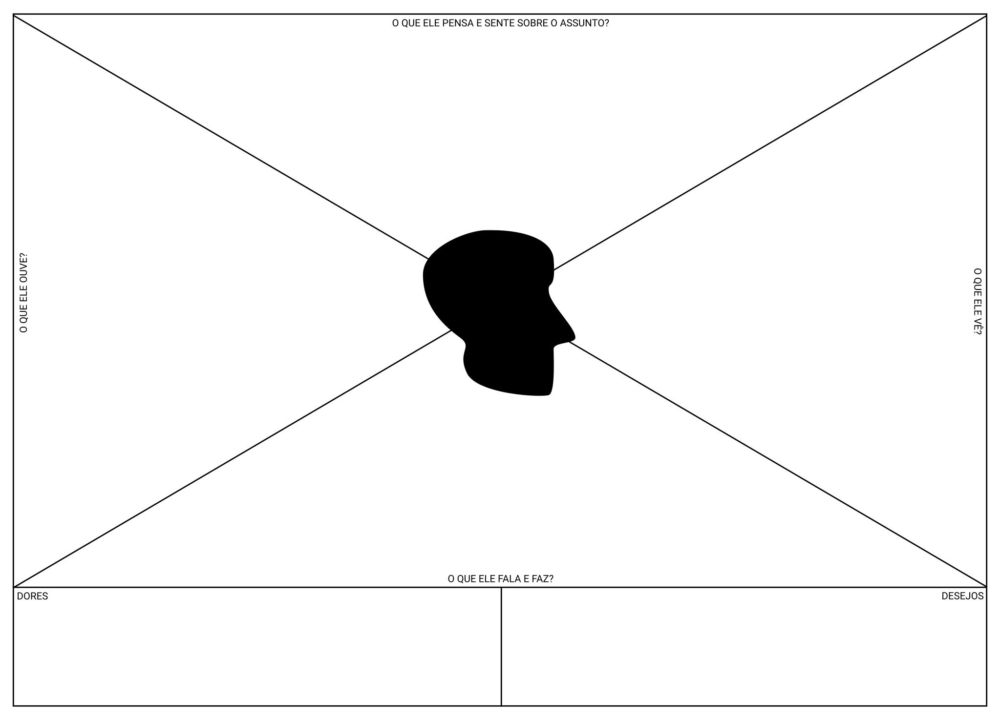

# Mapa de Empatia

### O que é?

O mapa de empatia é um diagrama para auxiliar a registrar e entender o ponto de vista de pessoas para as quais se está desenvolvido um projeto, e que atribuem valores e sentidos diferentes para as coisas (em relação à quem as projeta).

### No que os mapas de empatia são baseados?

Os mapas de empatia são baseados nos princípios de empatia e alteridade.

Os mapas de empatia são diagramas utilizados por antropólogos em estudos etnográficos, na tentativa de mapear/entender a origem dos sentidos atribuidos as coisas pelas pessoas sendo observadas.

Nas atividades projetuais, chamamos de "escuta altruísta" esta competência de em considerar tanto a alteridade (diferença entre as pessoas, e entre os pontos de vista do próprio projetista e dos usuários para os quais ele projeta), quanto se colocar no lugar destas pessoas e entender seus valores e sentidos.

### Como aplicar um mapa de empatia?

O registro das observações sobre cada usuário devem ser preenchidos no diagrama acima, registrando o que o usuário observado pensa e sente sobre um assunto na parte superior do quadro; aquilo que ele vê na parte direita; aquilo que ele ouve sobre o assunto investigado na parte esquerda, e o que ele fala e faz à respeito na parte inferior. Também se costuma registrar no diagrama aquilo que lhe incomoda (dores) no canto inferior esquerdo, e suas necessidades/desejos no canto inferior direito.

Os mapas de empatia pode ser úteis durante as primeiras observações e formulação/enquadramento de personas, geralmente feitas entre a Quest #1 , Quest #2 e Quest #3.

