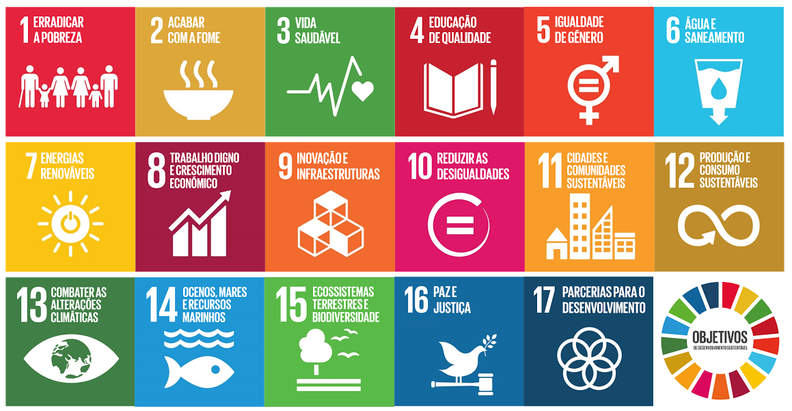

# if985_Projetão

30

Projetão é uma experiência de aprendisado para empreendedorismo. Aprender uma metodologia consistente de gerar novas e melhores soluções.

Essa inovação pode se encaminha para virar uma startup, mas a inovação pode ser para várias coisas: gerar inovação dentro do setor público, privado...

Para empreender, inovar apenas não é o suficiente. é um ponto de partida. Essa disciplina não é suficente para tratar da questão do empreendorismo como um todo, o foco está consentrado na inovação. 

Antes de chegar a um idéia é importante se expor a situações em que seja obrigado a pensar sobre determinado assunto, trazer algo relevante, tentar encontrar um problema importante

## A jornada da inovação tem 3 grandes fazes (dividas em 9 quests)

1 - Descoberta de uma oportunidade (faze mais importante)(Exite um desconforto em querer amadurecer o problema, geralmente se cai no erro de partir direto para a solução. Existe o erro de achar a solução certa para o problema errado(que é algo inútil))

2 - Projeto de solução inovadora

3 - Implementação da solução digital

A metodologia Projetão está organizada em nove atividades chamadas de "Quests", que procuram ajudar a responder questões importantes para o projeto. Cada uma das Quests tem um papel específico para a elaboração do projeto, e cada uma dela possui perguntas centrais que orientam as decisões necessárias no desenvolvimento da inovação.

### Quest 1 - Cenário & Pessoas

Levantamento "in loco" das atividades realizadas por diversos tipos de pessoas em algum espaço de sua escolha. A Quest #1 tem como objetivo ajudar a identificar questões reais, presentes no mundo real e nas atividades/dificuldades cotidianas das pessoas. É natural que aquilo que desejamos fazer como projeto seja fruto de como imaginamos o mundo, mas a inovação só acontece quando lidamos com o mundo concreto, e não com nossa suposição/desejo de como ele deveria ser.

Mergulhar em coisas diferentes para encontrar um bom problema
- Inovação começa por entender comportamentos, as dores e desejos.
- O intuito dessa quest não é definir seu projeto e sim investigar um cenário
- Levantamento preliminar de contextos e questões. Não fruto de suposições
- categorizar/classificar/qualificar 

- Porque este lugar é interessante?
- Quais as características deste espaço? (ele é privado? aberto ou fechado quantas pessoas circulam neste espaço?)
- Quais são os contrastes presentes (o que há demais ali, e o que está em falta)?
- Quem frequenta este espaço? Quem são estas pessoas? O que elas fazem lá?
- O que você não viu lá (mas esperava ver)?

### Quest 2 - Tema & Oportunidades
Definir o tema que interessa e qual você enxerga alguma oportunidade

Identificação de oportunidades de inovação dentro de uma temática. A Quest #2 aprofunda a observação realizada na atividade anterior, e tenta focar o olhar sobre as oportunidades que o cenário e as pessoas observados oferecem para uma potencial inovação. Nela definimos uma grande área, um tema geral, para o qual o projeto será direcionado.

### Quest 3 - Problema & Concorrentes
Escolha de um problema a ser resolvido, e identificação de quais são as alternativas já existentes que caberiam como uma solução para este mesmo problema. A Quest #3 tenta dar foco a uma das questões (dores ou desejos) levantadas previamente, e encontrar todos que já enfrentaram essa mesma questão antes, para construir um quadro do que é, e o que não é, necessário para ajudar as pessoas envolvidas.

Deixar bem claro qual o problema que você quer resolver (a dor que você quer sanar) e que concorrentes já estão trabalhando para sanar essa dor.

### Quest 4 - Proposta Única de Valor
O que você oferece de único que só você tem e ninguém tem que vai fazer você se destacar dos demais.

Identificação dos valores essenciais para a solução que será desenvolvida, e elaboração conceitual da solução de maneira que ela se torne a única a entregá-los plenamente ao usuário/consumidor. A Quest #4 ajuda a identificar o elemento central do projeto, e aquilo que precisa ser entregue ao usuário/consumidor para que se tenha um produto/serviço de sucesso (ou uma vantagem de lascar).

### Quest 5 - Estratégia de Inovação
Qual vai ser a sua estratégia

Definição dos elementos, funções, características e recursos mínimos para que um produto possa efetivamente ser lançado no mercado, apoiado em uma estratégia de inovação onde os valores essenciais definidos na Quest anterior possam ser entregues ao usuário/consumidor no menor prazo e com o menor esforço possível. A Quest #5 ajuda na elaboração de uma abordagem estratégica para o desenvolvimento do projeto.

### Quest 6 - Modelo de Negócio & ARM
Como é que você transforma isso em um negócio

Definição de um modelo de negócio para que todo o esforço empreendedor sendo desenvolvido seja sustentável a longo prazo, para que consiga arcar com seus custos, atender seus consumidores e se manter operando competitivamente. A Quest #6 ajuda a entender esta relação entre custos, recursos disponíveis, vantagens, métricas, etc. que são essenciais à viabilidade do projeto.

### Quest 7 - Prototipação & Usabilidade

Construção de protótipos, principalmente de baixa e média fidelidade, para realização de testes junto aos usuários afoitos, com intuito de entender o que precisa ser mantido, o que precisa ser melhorado e o que precisa ser drasticamente modificado na solução para que ela seja plenamente compreendida e utilizada pelos usuários/consumidores. É importante notar, neste momento, que o entendimento de uma solução para a qual não se tem referências ou experiências prévias pode ser mais difícil do que o normal, e aquilo que parece simples para quem está imerso em seu desenvolvimento, produz uma percepção completamente diferente sobre quem está tendo seu primeiro contato com o artefato.

### Quest 8 - Plano de Projeto

Organização do processo produtivo para que a solução proposta consiga ser construída e testada junto aos usuários afoitos antes de sua apresentação no Demoday. A Quest #8 ajuda a definir responsabilidades e atividades a serem desempenhadas até o prazo final do projeto.

### Quest 9 - Preparação para o Demoday

Planejamento da apresentação e da demonstração da solução no evento do Demoday. A Quest #9 auxilia no planejamento das atividades que serão realizadas no evento onde o projeto é apresentado publicamente, como em feiras de inovação e eventos de apresentação para investidores.

