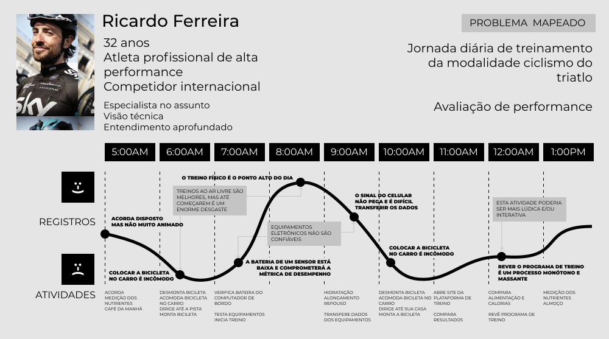

# Jornada do Usuário

### O que é?

A jornada do usuário é um diagrama que documenta as atividades de uma pessoa ou persona em relação a uma questão, assunto, produto ou serviço.

A jornada do usuário pode ser realizada em um intervalo pequeno de tempo (por exemplo, o que este usuário faz entre acordar e sair para o trabalho), uma duração maior como um dia inteiro, ou até grande durações como o ciclo de vida de um período de testes de um mês com um produto.

### No que a jornada do usuário é baseada?

A jornada do usuário é mais uma das diversas formas de registrar observações etnográficas. Ela é baseada nos customers journeys desenvolvidos pelo varejo, e na tentativa de identificar oportunidades potenciais para a promoção de produtos e/ou serviços, e seus gatilhos de compra, ao longo de momentos ociosos ou de atividades pouco exploradas na publicidade. Contudo, a técnica em si se demonstrou muito mais útil para um entendimento de como adequar os próprios produtos/serviços para situações ainda não exploradas.

### Como construir uma jornada do usuário?

A jornada do usuário é geralmente construída após observações feitas com técnicas como sombra ou um dia na vida do outro, onde acompanhamos um usuário ao longo de sua rotina, ou tentamos desempenhar as atividades que ele precisaria realizar.

Um dos aspectos mais importantes da jornada do usuário é tentar mapear, ao longo da jornada, as dores (pain points), desejos ou necessidades deste usuário em cada momento, e unir estas informações com registros de como este usuário se sente enquanto desempenha suas atividades. Com este diagrama, é possível notar difersos momentos e pontos onde uma intervenção (um novo produto ou serviço) possa ser necessário para melhorar sua relação com o que está fazendo.

### Como / quando usar?

Mapear a jornada do usuário pode ser um recurso bastante útil durante a Quest #3. Para isso, talvez seja mais conveniente desenvolvê-la ao longo da Quest #1 e Quest #2 