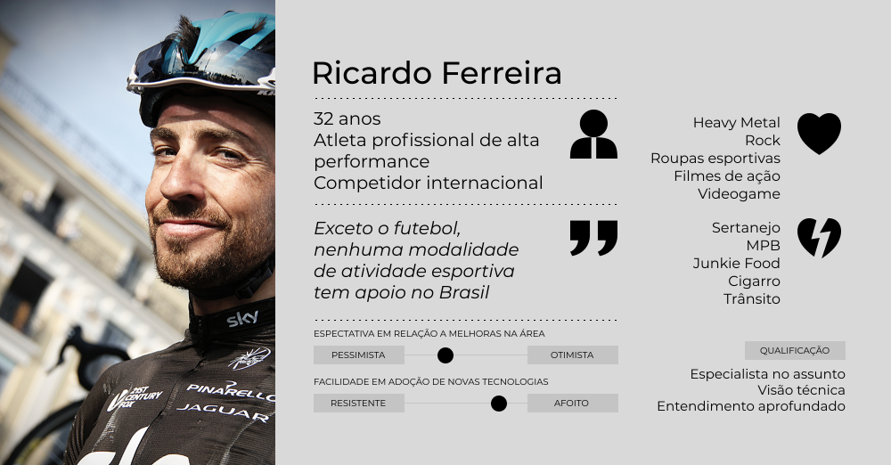

# Personas

### O que é?

Personas são uma representação de usuários do projeto. São a construção de um arquetipo, um personagem que sintetiza bem quem é o usuário, fruto da observação e identifiação das carateristicas e valores daqueles que irão usufruir do projeto, de forma com que ele se pareça com uma pessoa real, elencando, para isso, suas caracteristicas, atividades, motivações, relações, opiniões, desejos e interesses.

### No que a técnica é baseada?

A definição de Personas é uma técnica criada por Alan Cooper, famoso pelos livros "About Face" sobre design de interfaces, e "The inmates are running the asylum", sobre o processo de desenvolvimento de projetos digitais.

A ideia de Cooper, quando elaborou esta técnica, foi tornar o usuário final de um produto em uma figura mais próxima e mais tangível para uma equipe de desenvolvimento de software. Cooper percebeu que as equipes que lidavam com uma idéia abstrata de "usuário" (genérico, sem rosto, distante) tendiam a se preocupar pouco com suas necessidades e não davam a devida atenção a como este usuário se sentiria ao usar o produto final.

Ao criar uma Persona, produzimos uma relação de identificação entre os projetistas e os usuários do projeto, e isso ajuda muito a aproximá-los, principalmente no que diz respeito a entender como estes usuários desejam que o produto seja, ou se comporte.

### Como construir uma Persona?

Não há uma forma certa, ou errada, de construir uma Persona. No geral, para cada Persona atribuímos uma foto, um nome, características como idade, profissão e outras informações demográficas, e pontuamos os interesses e relações que estas pessoas estabeleceriam com o projeto em desenvolvimento.

Na IDEO, empresa renomada em inovação e desenvolvimento de produtos, eles imprimem usuários de corpo inteiro em dimensões reais, e fixam estas imagens nas paredes das salas de reunião, como se os usuários estivessem ali de pé olhando para a equipe de desenvolvimento, participando de cada decisão sendo tomada. Isto é feito para que os projetistas nunca esqueçam de levá-los em consideração durante todo o processo.

#### Dicas

Inclua em suas Personas informações sobre personalidade, humor, gostos e interesses: isto ajuda a entender melhor quem é o usuário, o que o ele quer, e como ele verá o projeto. Tente tornar a Persona o mais humana possível, mas evite trazer á tona caracteristicas depreciativas ou que lhes tornem antipáticos, criando um afastamento do interesse dos projetistas em relação a este usuário. O intuito da Persona é criar laços e afeição dos projetistas pelos usuários do projeto, jamais criar um sentimento de que aquele usuário não merece o esforço sendo empregado pela equipe.

Não use ilustrações, desenhos, ou imagens de pessoas públicas/conhecidas para representar as Personas. A Persona precisa personificar e presentificar o usuário, e não produzir uma relação de representação ou imaginação sobre ele; ela deve fazer você sentir que este usuário existe, e é aquele que está ali na foto.

O diagrama de uma Persona não precisa ser algo muito sofisticado para que funcione, mas se você conseguir enriquecê-lo com informações que fazem diferença no projeto, pode tornar esta ferramenta ainda mais útil.

#### Como / quando usar?

Personas podem ser utilizadas durante todo o ciclo do projeto.

No início, são úteis para dar foco e orientar o projeto cerca das necessidades e desejos dos usuários, principalmente na Quest #1 Quest #2 Quest #3

No fim, são úteis narrativamente, e ajudam a explicar o sentido do projeto para os próprios usuários ou para investidores e stake holders, usados nos Pitchs na Quest #6 Quest #9

